# MasterChefCelebrityAPI    
### Laura Alejandra Venegas Piraban    

## Descripción del proyecto    
API REST para la gestión de recetas del programa de televisión **MasterChef Celebrity**.  
Permite a televidentes, participantes y chefs jurados registrar, consultar y gestionar recetas de cocina.    

**Compilar el proyecto:**    
mvn clean install   

**Ejecutar la aplicación:**  
mvn spring-boot:run  

## Endpoints  
Para probar los endpoints se utilizó Thunder Client.  

1. Registrar una receta de un televidente
<p align="center"> 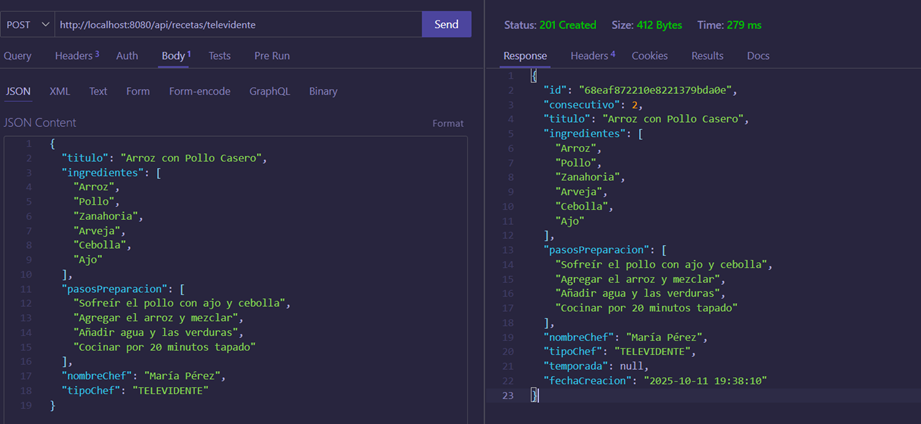 </p> 
json  
{
  "titulo": "Arroz con Pollo Casero",
  "ingredientes": [
    "Arroz",
    "Pollo",
    "Zanahoria",
    "Arveja",
    "Cebolla"
  ],
  "pasosPreparacion": [
    "Sofreír el pollo con ajo y cebolla",
    "Agregar el arroz y mezclar bien",
    "Añadir agua y las verduras",
    "Cocinar por 20 minutos tapado"
  ],
  "nombreChef": "María Pérez",
  "TipoChef": "TELEVIDENTE"
}

2. Registrar una receta de un participante
<p align="center"> 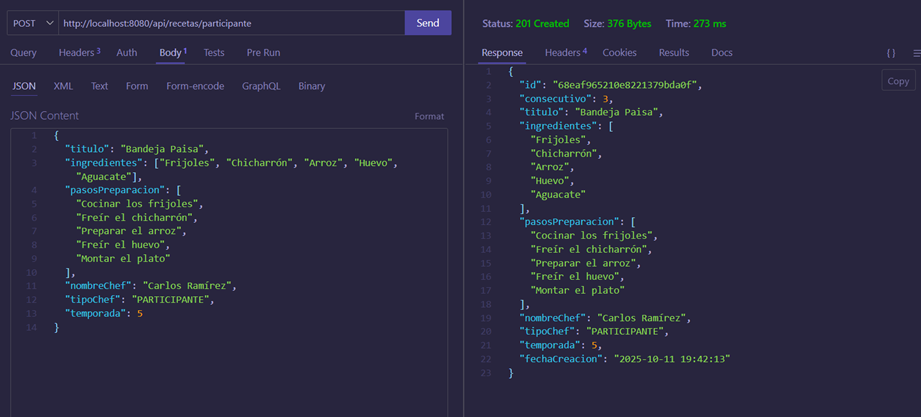 </p>
json
Copiar código
{
  "titulo": "Bandeja Paisa",
  "ingredientes": ["Frijoles", "Chicharrón", "Arroz", "Huevo", "Aguacate"],
  "pasosPreparacion": [
    "Cocinar los frijoles",
    "Freír el chicharrón",
    "Preparar el arroz",
    "Freír el huevo",
    "Montar el plato"
  ],
  "nombreChef": "Carlos Ramírez",
  "tipoChef": "PARTICIPANTE",
  "temporada": 5
}
Endpoint: http://localhost:8080/api/recetas/participante

3. Registrar una receta de un chef
<p align="center"> 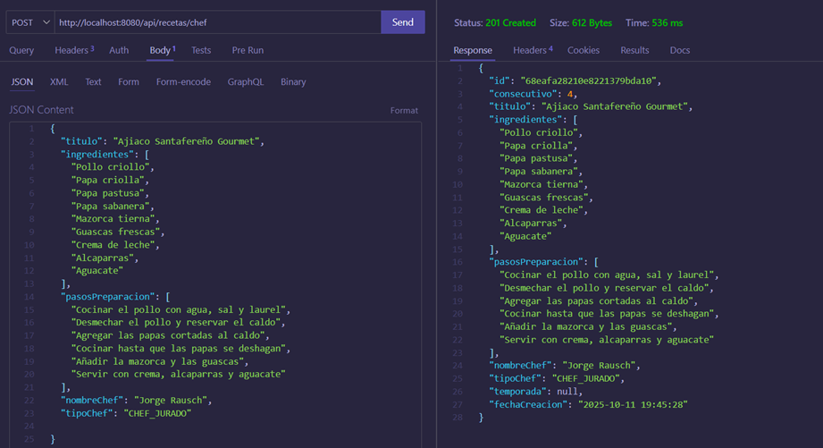 </p>
json
Copiar código
{
  "titulo": "Ajiaco Santafereño Gourmet",
  "ingredientes": [
    "Pollo criollo",
    "Papa criolla",
    "Papa pastusa",
    "Papa sabanera",
    "Mazorca tierna",
    "Guascas frescas",
    "Crema de leche",
    "Alcaparras",
    "Aguacate"
  ],
  "pasosPreparacion": [
    "Cocinar el pollo con agua, sal y laurel",
    "Desmechar el pollo y reservar el caldo",
    "Agregar las papas cortadas al caldo",
    "Cocinar hasta que las papas se deshagan",
    "Añadir la mazorca y las guascas",
    "Servir con crema, alcaparras y aguacate"
  ],
  "nombreChef": "Jorge Rausch",
  "tipoChef": "CHEF_JURADO"
}
Endpoint: http://localhost:8080/api/recetas/chef

4. Devolver todas las recetas guardadas
<p align="center"> 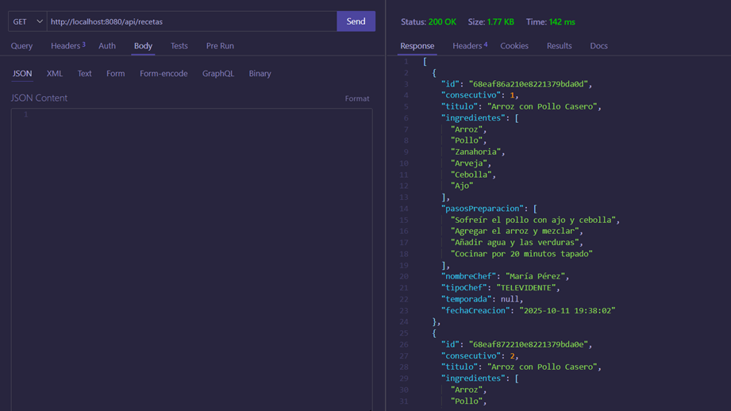 </p>
Endpoint: http://localhost:8080/api/recetas

5. Devolver cada receta por su número de consecutivo
<p align="center"> 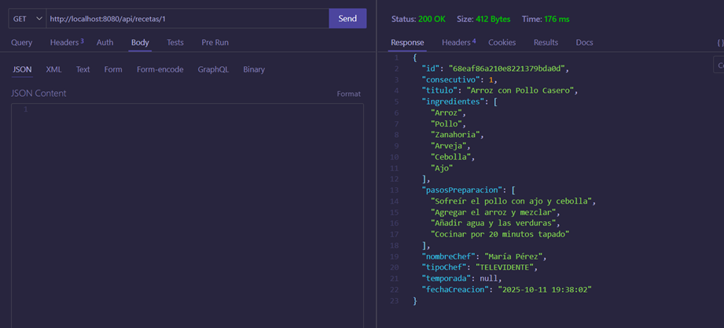 </p>
Endpoint: http://localhost:8080/api/recetas/1

6. Devolver las recetas de participantes del programa
<p align="center"> 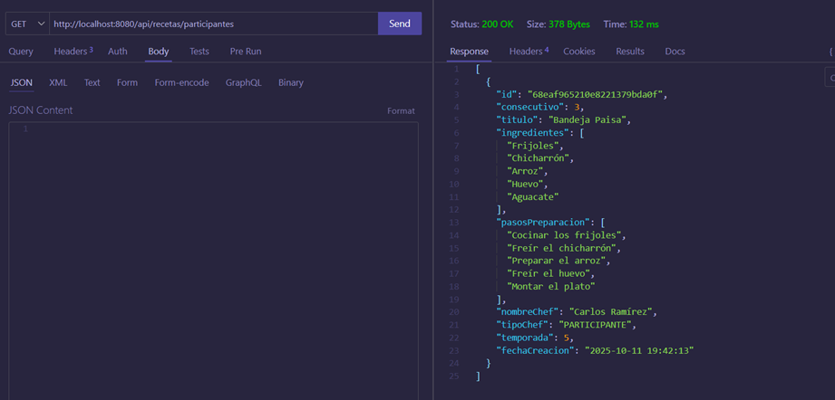 </p>
Endpoint: http://localhost:8080/api/recetas/participantes

7. Devolver las recetas de televidentes del programa
<p align="center"> 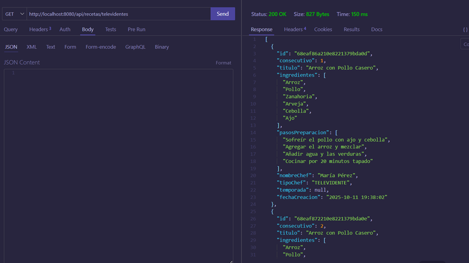 </p>
Endpoint: http://localhost:8080/api/recetas/televidentes

8. Devolver las recetas de chefs del programa
<p align="center"> 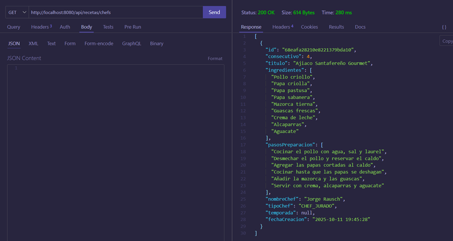 </p>
Endpoint: http://localhost:8080/api/recetas/chefs

9. Devolver las recetas por temporada
<p align="center"> 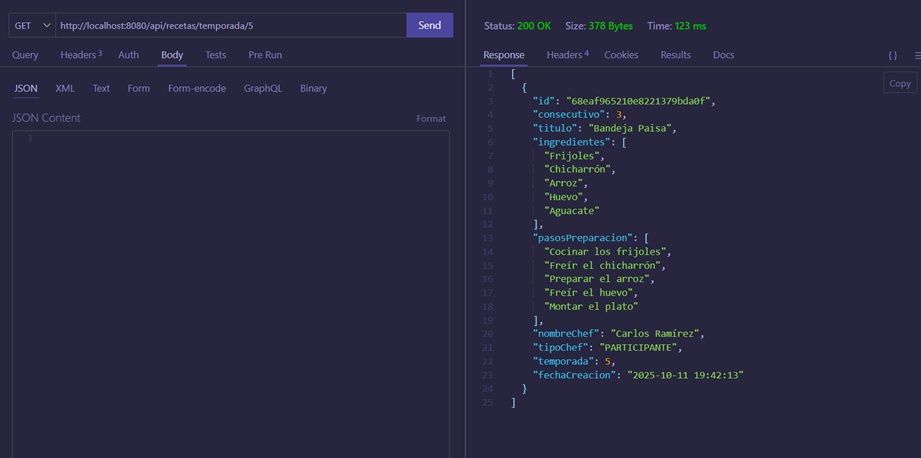 </p>
Endpoint: http://localhost:8080/api/recetas/temporada/5

10. Buscar recetas que incluyan un ingrediente específico
<p align="center"> 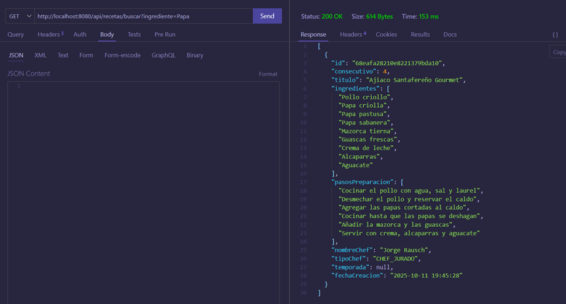 </p>
Endpoint: http://localhost:8080/api/recetas/buscar?ingrediente=Papa

11. Eliminar una receta
<p align="center"> 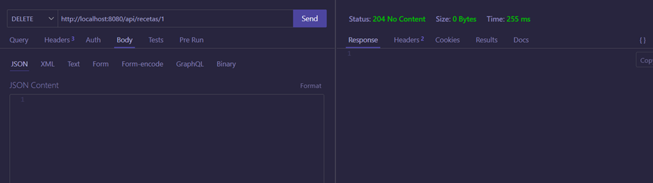 </p>
12. Actualizar una receta
<p align="center"> 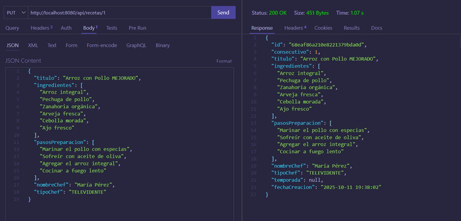 </p>
json
Copiar código
{
  "titulo": "Arroz con Pollo MEJORADO",
  "ingredientes": [
    "Arroz integral",
    "Pechuga de pollo",
    "Zanahoria orgánica",
    "Arveja fresca",
    "Cebolla morada",
    "Ajo fresco"
  ],
  "pasosPreparacion": [
    "Marinar el pollo con especias",
    "Sofreír con aceite de oliva",
    "Agregar el arroz integral",
    "Cocinar a fuego lento"
  ],
  "nombreChef": "María Pérez",
  "tipoChef": "TELEVIDENTE"
}
Endpoint: http://localhost:8080/api/recetas/1

## SWAGGER
Enlace: http://localhost:8080/swagger-ui/index.html

<p align="center">  </p> <p align="center"> 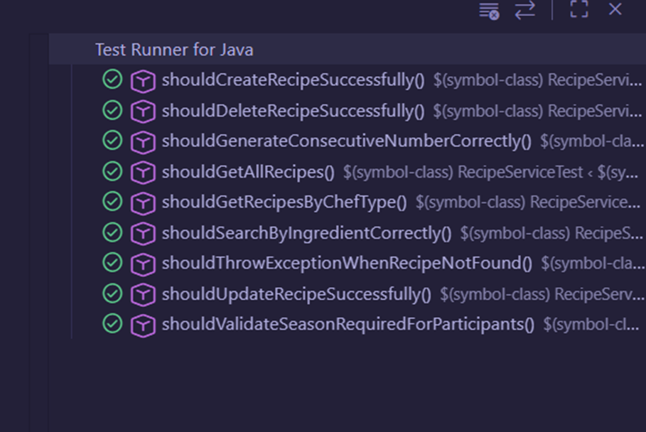 </p> <p align="center"> 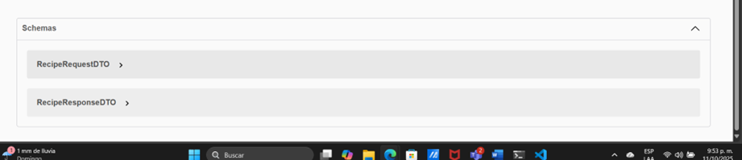 </p>
Persistencia
<p align="center"> 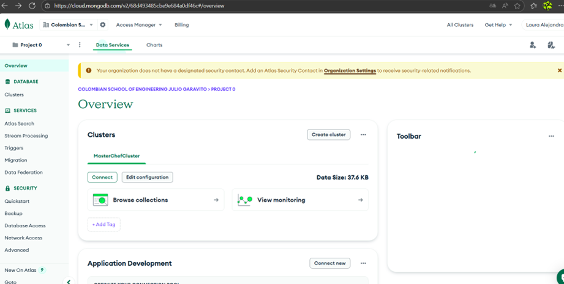 </p> <p align="center">  </p>

## Pruebas unitarias
<p align="center">  </p> ```